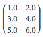

# Stuart ML - Data types

* [Vector](#vector)
* [Matrix](#matrix)

## Vector

A vector has numeric-typed and 0-based indices (unlike 1-based Lua arrays) and numeric-typed values. Stuart ML supports two types of vectors: dense and sparse. A dense vector is backed by a double array representing its entry values, while a sparse vector is backed by two parallel arrays: indices and values. For example, a vector `{1.0, 0.0, 3.0}` can be represented in dense format as `{1.0, 0.0, 3.0}` or in sparse format as `{3, {0, 2}, {1.0, 3.0}}`, where 3 is the size of the vector.

The base class of local vectors is `Vector`, and we provide two implementations: `DenseVector` and `SparseVector`. We recommend using the factory methods implemented in `Vectors` to create vectors.

```lua
Vectors = require 'stuart-ml.linalg.Vectors'

denseVector = Vectors.dense({0.1, 0.0, 0.3})
print(denseVector)
0.1,0,0.3

sparseVector = Vectors.sparse(5, {0,1,4}, {10,11,12})
print(sparseVector)
10,11,0,0,12
```

## Matrix

A matrix has numeric-typed row and column indices and numeric-typed values. Stuart ML supports dense matrices, whose entry values are stored in a single table in column-major order, and sparse matrices, whose non-zero entry values are stored in the Compressed Sparse Column (CSC) format in column-major order. For example, the following dense matrix

<center></center>

is stored in a one-dimensional table `{1.0, 3.0, 5.0, 2.0, 4.0, 6.0}` with the matrix size `(3, 2)`.

The base class of matrices is `Matrix`, and we provide two implementations: `DenseMatrix`, and `SparseMatrix`. We recommend using the factory methods implemented in `Matrices` to create matrices. Remember, matrices in Stuart ML are stored in column-major order.

```lua
Matrix = require 'stuart-ml.linalg.Matrix'
Matrices = require 'stuart-ml.linalg.Matrices'

-- Create a dense matrix ((1.0, 2.0), (3.0, 4.0), (5.0, 6.0))
local dm = Matrices.dense(3, 2, {1.0, 3.0, 5.0, 2.0, 4.0, 6.0})

-- Create a sparse matrix ((9.0, 0.0), (0.0, 8.0), (0.0, 6.0))
local sm = Matrices.sparse(3, 2, {0, 1, 3}, {0, 2, 1}, {9, 6, 8})
```
